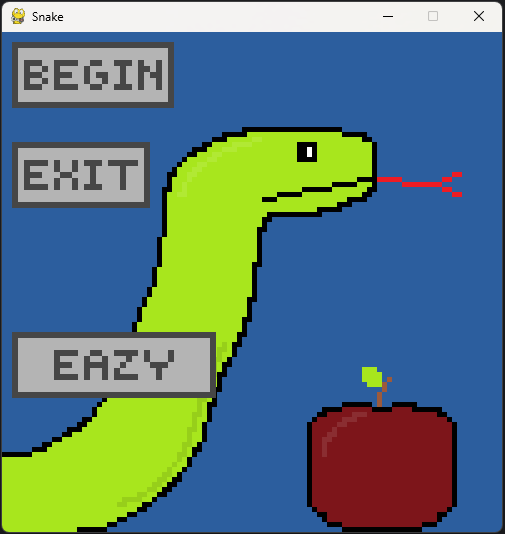
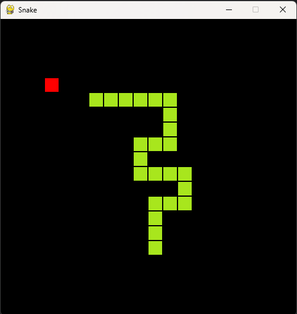

# Snake game in pyGame




## How to download and run

- Just download [the source code from github](https://github.com/klapekm/python_pygame_snake/archive/refs/heads/master.zip)
- Once you download the file just unpack it and run
```python snake.py```

## Options

- Click BEGIN to start the game
- Click EXIT to close the game
- Use the option button to change the difficulty


